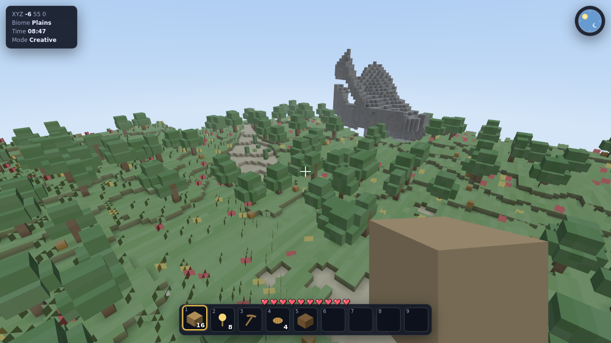
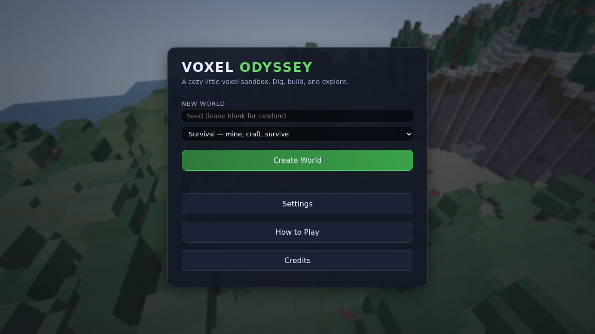
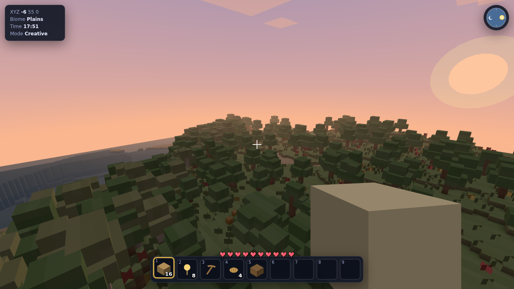
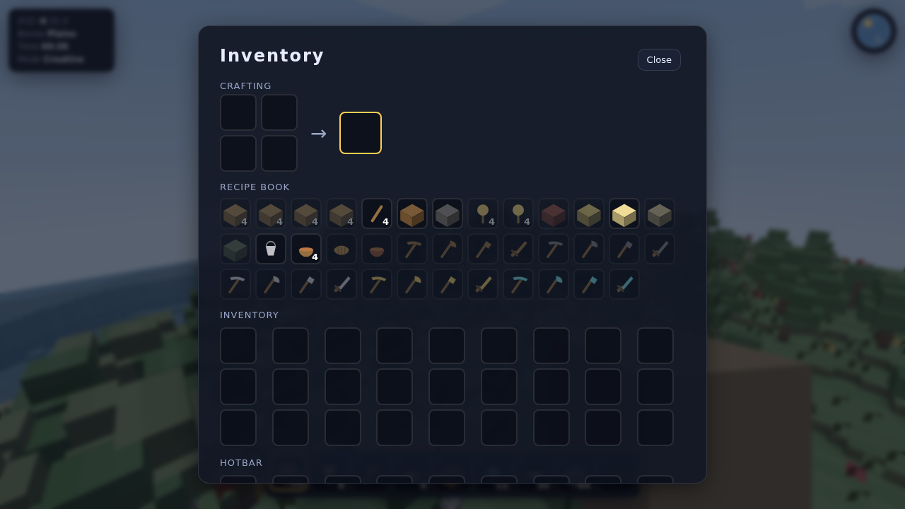

# 🌍 Voxel Odyssey

A fun, fully-featured **first-person voxel sandbox** that runs entirely in your
browser — explore an infinite procedurally-generated world, mine and build,
craft tools, survive the night, and watch the sun rise over your creations.

Built from scratch with **Three.js** (vendored locally — no build step, no
network required) and a hand-rolled voxel engine: procedural terrain & biomes,
face-culled chunk meshing with ambient occlusion, swept-AABB physics,
**Minecraft-style flood-fill lighting**, **multiplayer**, **resource pack
support**, mobs with AI, crafting, particles, and fully synthesized audio
(no asset files anywhere).



<p align="center">
  
  
  
</p>

## ▶️ Play

### The quick way — one file, no server

Download **[`dist/voxel-odyssey.html`](dist/voxel-odyssey.html)** and double-click
it. That's the whole game — engine, Three.js, art and audio — in a single 1.5 MB
file with everything inlined, so it opens straight from disk and works offline.

### From source

The source runs unbundled via ES modules + an import map, which browsers only
allow over HTTP. From this folder:

```bash
# pick any one:
python3 -m http.server 8080
npx serve -l 8080 .
npx http-server -p 8080 .
```

Then open <http://localhost:8080> and click **New World**.

> Click the screen to capture the mouse. Press **Esc** to pause / release it.
> Where a page embeds the game and blocks the Pointer Lock API, it falls back
> automatically to hiding the cursor and steering on raw mouse movement.

### Rebuilding the single file

```bash
npm install          # esbuild, the only dev dependency
npm run build        # -> dist/voxel-odyssey.html
npm run build:fragment   # same, minus the <html>/<head>/<body> wrapper, for embedding
```

## 👥 Multiplayer

Run a server — it hosts the game *and* serves the client, so one process is
the whole setup:

```bash
npm run server                 # http://localhost:8090
node server/index.js --port 8090 --seed my-world --max-players 32
```

Open that address in a browser and press **Join Multiplayer** (it defaults to
the server you loaded the page from). Others join the same address.

The server is authoritative over the world: block edits are validated for
reach and rate, then broadcast, so two players racing for the same block
always resolve the same way for everyone. Clients apply their own edits
immediately and reconcile against the server's answer, so building stays
responsive at any latency. Remote players are interpolated and fully
animated. `GET /status` reports player count, tick and edit count.

No dependencies — the WebSocket layer is implemented directly against
RFC 6455.

## 🎨 Resource packs

**Drag a Minecraft resource pack `.zip` onto the window.** Packs from
Modrinth, CurseForge or anywhere else work as-is — no unpacking, no
conversion. Textures the pack doesn't include keep the built-in procedural
versions, and both modern (`grass_block_top`) and pre-1.13 (`grass_top`)
naming is understood. The pack is remembered between sessions.

Without a pack the game synthesizes its own complete 16px texture set at
startup, generated as code rather than shipped as art.

## 🎮 Controls

| Action | Key |
| --- | --- |
| Move | `W` `A` `S` `D` |
| Look | Mouse |
| Jump | `Space` |
| Sprint | `Ctrl` (hold) or double-tap `W` |
| Sneak | `Shift` |
| Mine block | Hold **Left Mouse** |
| Place block / use / eat | **Right Mouse** |
| Attack mob | **Left Mouse** (click) |
| Select hotbar slot | `1`–`9` or mouse wheel |
| Open inventory / crafting | `E` |
| Drop item | `Q` |
| Toggle creative flight | `F` (in creative) |
| Debug overlay | `F3` |
| Pause / menu | `Esc` |

Every binding is remappable in **Settings → Customise Controls**. Gamepads are
supported (left stick moves, right stick looks) with an adjustable deadzone
and look speed.

## ✨ Features

- **Infinite procedural world** — multi-octave terrain with plains, forests,
  deserts, mountains, snowy peaks, beaches and oceans; caves, ore veins, trees,
  flowers, cacti and mushrooms.
- **Mine & build** — 40+ block types, face-culled chunk meshing with ambient
  occlusion and per-voxel color variation for a clean low-poly look.
- **Crafting & inventory** — a full 36-slot inventory, 2×2 and 3×3 crafting,
  drag-and-drop, a recipe book, tools of five tiers, food, and torches.
- **Survival** — health, fall damage, drowning, hunger for food, and a
  **Creative** mode with flight for pure building.
- **Mobs** — passive animals (pig, cow, sheep, chicken) and hostiles that come
  out at night (zombie, skeleton, spider) with simple chase/melee AI.
- **Dynamic day/night** — a moving sun and moon, gradient sky, drifting clouds,
  a starfield, and fog that all shift through dawn, day, dusk and night.
- **Effects & audio** — block-break particles, water splashes, and a fully
  **synthesized** soundscape + gentle ambient music (zero audio files).
- **Saves** — your world (seed + your edits + inventory) persists in
  `localStorage`; **Continue** picks up where you left off.

## 🧱 Architecture

Everything is plain ES modules under `js/` (no bundler). See
[`ARCHITECTURE.md`](ARCHITECTURE.md) for the full module contract.

```
index.html            import map + loading screen + UI layers
styles.css            HUD / menu / inventory styling
vendor/three.module.js  Three.js r160 (vendored, MIT)
js/
  main.js             bootstrap, game-flow state machine, the loop
  core/   utils, events (bus), state (settings/save), input, engine
  world/  constants, blocks, noise, worldgen, chunk (mesher), world,
          lighting (flood fill), meshPool + mesher.worker (off-thread meshing)
  render/ material (voxel shader), atlas (texture array), textures
          (procedural set), resourcepack (.zip reader), resources
  net/    client (prediction + interpolation), remotePlayers (rigs)
  entities/  player, mob, entityManager
  items/  items (registry + icons), inventory, crafting
  fx/     particles, audio, sky
  ui/     hud, menus
shared/ protocol.js  — wire format, imported by both client and server
server/ index.js (game server + static host), websocket.js (RFC 6455)
tests/  run, lighting, resourcepack, multiplayer (node) + smoke, interact (browser)
tools/  build-single-file.mjs (inlines everything into dist/voxel-odyssey.html)
```

### How lighting works

Terrain is **not** lit by a directional light — one can't be occluded by
voxels, so caves and sealed rooms came out as bright as open ground. Instead
`world/lighting.js` floods light through the voxel grid the way Minecraft
does: skylight seeded at 15 per column, falling straight down unattenuated and
spreading sideways at 1 per step, plus blocklight from torches and glowstone.
Both are packed as nibbles into one byte per voxel.

The mesher emits that light as a **vertex attribute** while the time of day
stays a **uniform**, so a full day-to-night swing re-lights every chunk in the
world without re-meshing any of it.

## 🧪 Tests

```bash
npm test                     # all Node suites (162 assertions)
node tests/run.js            # pure logic: noise, worldgen, meshing, inventory, crafting
node tests/lighting.test.mjs # light propagation: falloff, shadows, relighting, cross-chunk
node tests/resourcepack.test.mjs  # the ZIP reader, against archives built byte-by-byte
node tests/multiplayer.test.mjs   # protocol round-trips + a live server driven by real sockets

npm run test:browser         # headless Chromium: rendering + real gameplay
```

## 📄 License

MIT. Three.js © its authors (MIT), vendored in `vendor/`.
